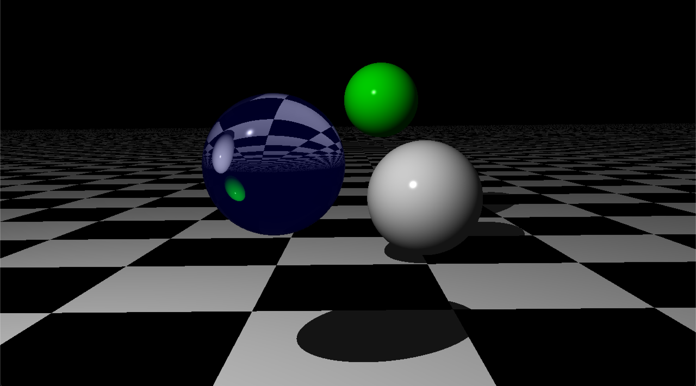

[](https://github.com/ipersids/ray-tracing/actions/workflows/unit-tests.yml)

<div align="center">

<h1>MiniRT</h1> 

<picture>

</picture>

</div>

#### Introduction   
MiniRT is a rendering program that uses ray tracing technology to create realistic images with a given configuration.  

#### Table of Contents  
- [Features](#features)  
- [Controls](#controls)
- [Project structure](#project-structure)  
- [Installation](#installation)  

## Features  

- [x] Scene description parsed from `.rt` files.  
- [x] Custom math, matrix and vector utilities.   
- [x] Real-time rendering with MLX42 graphical library.  
- [x] Simple ray tracer supporting spheres, planes, cylinders, and cones.  
- [x] Point and ambient lighting with basic shading.  
- [x] Camera with field of view and orientation control.  
- [x] Shading, shadows and patterns.
- [x] Reflection.
- [x] Refraction.
- [x] Sphere texture and bump mapping.
- [x] Different materials support.

## Controls

| Action                                 | Key / Mouse                             | Description                                      |
|----------------------------------------|-----------------------------------------|--------------------------------------------------|
| Move camera                            | `W` / `A` / `S` / `D`                   | Move camera forward, left, back, right           |
| Rotate camera                          | Left Mouse Drag                         | Rotate camera view                               |
| Reset camera                           | `R`                                     | Reset camera to default position/orientation     |
| Zoom camera                            | Mouse Scroll                            | Zoom in/out (FOV)                                |
| Select & manipulate object             | Right Mouse Button                      | Select object under cursor for manipulation      |
| Move selected object                   | Right Mouse Drag                        | Move object in screen plane                      |
| Move selected object (depth)           | `Ctrl` + Right Mouse Drag               | Move object along view direction                 |
| Rotate selected object                 | `W` / `A` / `S` / `D` (object selected) | Rotate object (pitch/yaw)                        |
| Scale selected object                  | `+` / `-` (object selected)             | Scale object up/down                             |
| Exit                                   | `ESC`                                   | Exit program                                     |

## Project structure

```css
ray-tracing/
│
├── include/                  # Header files
│   ├── minirt_data.h
│   ├── ...
│   └── minirt.h
│
├── lib/                      # Libraries
│   ├── libft/                # Submodule libft
│   └── mlx42/                # Submodule MLX42
│
├── scene/                    # Scene config files
│   └── simple.rt
│
├── src/                      # Source files
│   ├── constructor/
│   │   └── *.c
│   ├── destructor/
│   │   └── *.c
│   ├── .../
│   │   └── *.c
│   ├── parser/
│   │   └── *.c
│   └── main.c
│
├── ...
└── Makefile                  # Building project tool

```   

## Installation   

1. Clone the repository and build the project using the provided `Makefile`:  
```bash
git clone https://github.com/ipersids/ray-tracing.git
cd ray-tracing
make
```   

2. Run the ray tracer with the path to the config file:  
```bash
./miniRT scene/simple.rt
```  

**Other commands:**  
	* `make clean` will remove all .o' files.  
	* `make fclean` will remove all .o' and executable files.  
	* `make re` will trigger the fclean command and rebuild the program.    

**Linker dependencies:**   

| Flag | Library | Purpose|
|------|---------|--------|
| `-ldl` | libdl | Dynamic linking support |
| `-lglfw` | GLFW | OpenGL window/context/input handling |
| `-lm` | libm | C math library |
| `-lmlx42`| MLX42 | Cross-platform, minimal windowing graphics library |
| `-lft`  | libft |  Own customized version of the standard C library |   

________  
<div align="center">

<p><a href="https://www.hive.fi/en/curriculum">Hive (42 School Network)</a></p>  
<p>Developed by <a href="https://github.com/EggInAVest">Roni Eerikainen</a> and <a href="https://github.com/ipersids">Julia Persidskaia</a>.</p>

</div>
